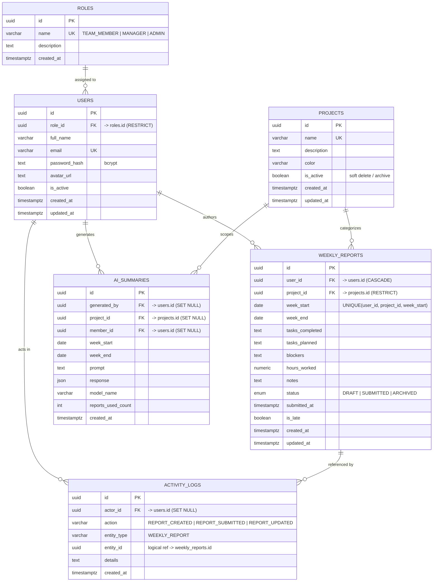

# PulseBoard — Entity Relationship Diagram

The database has **6 tables**: `roles`, `users`, `projects`, `weekly_reports`,
`ai_summaries`, and `activity_logs`. All primary keys are UUIDs. The diagram
below renders automatically on GitHub.

## ER Diagram (Mermaid)



## Relationships

| From | To | Cardinality | FK | On delete |
|------|----|-------------|----|-----------|
| roles | users | 1 → many | `users.role_id` | RESTRICT |
| users | weekly_reports | 1 → many | `weekly_reports.user_id` | CASCADE |
| projects | weekly_reports | 1 → many | `weekly_reports.project_id` | RESTRICT |
| users | ai_summaries | 1 → many | `ai_summaries.generated_by`, `member_id` | SET NULL |
| projects | ai_summaries | 1 → many | `ai_summaries.project_id` | SET NULL |
| users | activity_logs | 1 → many | `activity_logs.actor_id` | SET NULL |
| weekly_reports | activity_logs | 1 → many | `activity_logs.entity_id` (logical) | — |

Key constraints:
- **Unique** `(user_id, project_id, week_start)` on `weekly_reports` — one report per member, per project, per week (keeps reports consistent and comparable).
- **Unique** `email` on `users`, **unique** `name` on `roles` and `projects`.
- Soft delete via `is_active` on `projects` (and `users`) — archived records are hidden, not destroyed.

## DBML (for dbdiagram.io)

Paste into https://dbdiagram.io to render/export a shareable diagram.

```dbml
Table roles {
  id uuid [pk]
  name varchar [unique, not null]
  description text
  created_at timestamptz [not null]
}

Table users {
  id uuid [pk]
  role_id uuid [not null]
  full_name varchar [not null]
  email varchar [unique, not null]
  password_hash text [not null]
  avatar_url text
  is_active boolean [not null, default: true]
  created_at timestamptz [not null]
  updated_at timestamptz [not null]
}

Table projects {
  id uuid [pk]
  name varchar [unique, not null]
  description text
  color varchar
  is_active boolean [not null, default: true]
  created_at timestamptz [not null]
  updated_at timestamptz [not null]
}

Table weekly_reports {
  id uuid [pk]
  user_id uuid [not null]
  project_id uuid [not null]
  week_start date [not null]
  week_end date [not null]
  tasks_completed text
  tasks_planned text
  blockers text
  hours_worked numeric
  notes text
  status varchar [not null, note: 'DRAFT | SUBMITTED | ARCHIVED']
  submitted_at timestamptz
  is_late boolean [not null, default: false]
  created_at timestamptz [not null]
  updated_at timestamptz [not null]
  indexes {
    (user_id, project_id, week_start) [unique]
  }
}

Table ai_summaries {
  id uuid [pk]
  generated_by uuid
  project_id uuid
  member_id uuid
  week_start date [not null]
  week_end date [not null]
  prompt text [not null]
  response json [not null]
  model_name varchar
  reports_used_count int [not null, default: 0]
  created_at timestamptz [not null]
}

Table activity_logs {
  id uuid [pk]
  actor_id uuid
  action varchar [not null]
  entity_type varchar [not null]
  entity_id uuid
  details text
  created_at timestamptz [not null]
}

Ref: users.role_id > roles.id
Ref: weekly_reports.user_id > users.id
Ref: weekly_reports.project_id > projects.id
Ref: ai_summaries.generated_by > users.id
Ref: ai_summaries.member_id > users.id
Ref: ai_summaries.project_id > projects.id
Ref: activity_logs.actor_id > users.id
```
